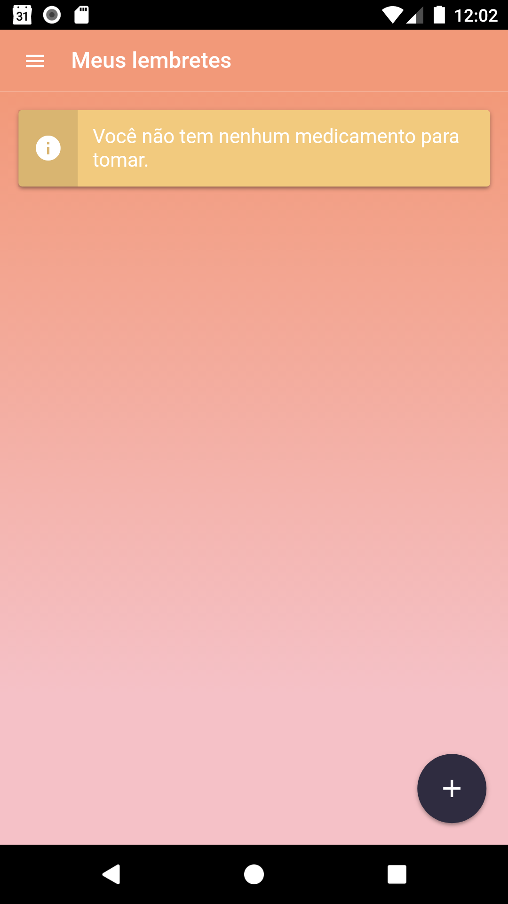
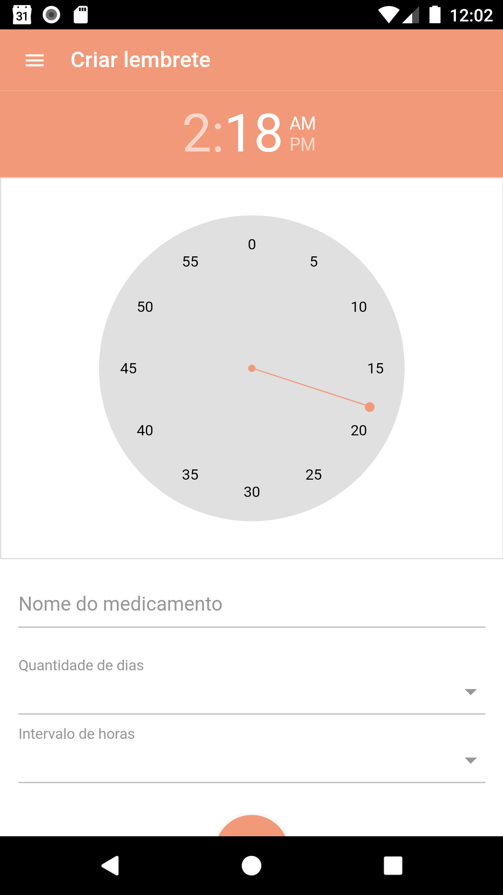
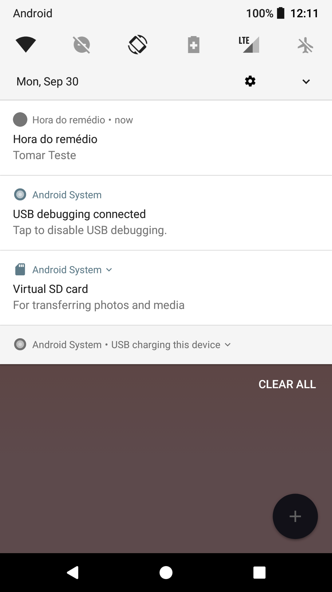

# Hora do remédio

### Ficou doente e tá cheio de remédio pra tomar? Seus problemas acabaram! Com o hora do remédio você não se esquecerá de tomar suas dorguinhas :D

## About

Fiz esse app em uma das vezes que fiquei doente. Estava de cama e com aquela pilha de remédio que o médico havia prescritom, então para me ajuda a lembrar quando eu deveria tomar cada um acabei fazendo esse app.

Como todo bom software contém alguns bugs com esse não seria diferente.  Por algum motivo, que ainda não descobri, as notificações falham aleatóriamente. Se algúem quiser fazer uma correção e me enviar um pull request ficaria bem agradecido :D

Se quiser copiar para estudar ou qualquer outro fim sinta-se livre.


## Technologies

<p>Principais tecnologias que utilizei nesse app:</p>

 - Quasar framework ⭐
 - Cordova (o quasar utiliza ele por de baixo dos panos)
 - Vue js 💓
 - Localstorage 📁
 - local nofications ⏰
 - admob 🤑 (O projeto tem configurado, mas não estou utilizando)

## Scheenshots

<p>Home</p>



<p>Tela de alarme</p>



<p>Tela de notificação</p>




## Installation

```
  $ npm install

  $ npm run dev:android

```

Se der algum problema confira como instalar a cli do quasar [aqui](https://quasar.dev/quasar-cli/installation).


## Download

Publiquei ele também na [Playstore](https://play.google.com/store/apps/details?id=br.com.niltonlopes.hdr&hl=pt_BR)
